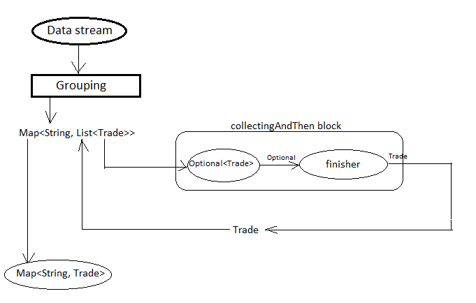
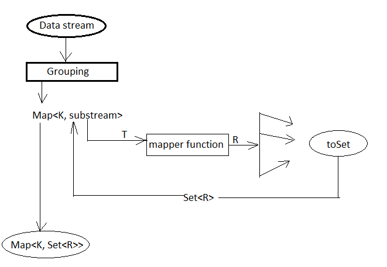

Predefined Collectors
=====================
In the previous chapter you got an overal idea on how does collector works and how to implement custom collectors. Java-8 has introduced ``java.util.stream.Collectors`` utility class containing many factory methods that provides most commonly used ``Collector`` implementations. These collectors mainly offers following functionalities:

- Collecting elements to a `java.util.Collection`
- Joining String elements to a single String
- Grouping elements by custom grouping key
- Partitioning elements into TRUE FALSE group
- Reducing operations
- Summerizing elements

These factory methods can also be combined to generate nested Collector that we will see while moving deeper.

Collecting as collections
-------------------------
Collecting stream elements to a `java.util.Collection` is the most widely used operation. Collectors class provide couple of methods that returns a collector which will then collect stream elements to a specific collection container.

.. list-table::

   * - Collector<T, ?, List<T>> toList()
   * - Collector<T, ?, Set<T>> toSet()
   * - Collector<T, ?, C> toCollection(Supplier<C> collectionFactory)
   * - Collector<T, ?, Map<K,U>> toMap(Function<T, K> keyMapper, Function<T, U> valueMapper)
   
  
- **toList():**
    Returns a Collector that will accumulate stream elements into ArrayList in the encountered order.

    .. code:: java

      List<String> list = Stream.of("java", ".net", "python")
                .map(String::toUpperCase).collect(Collectors.toList());

- **toSet():**
    Returns a Collector that will accumulate stream elements into HashSet object.

    .. code:: java

      Set<String> set = Stream.of("java", ".net", "python")
                .map(String::toUpperCase).collect(Collectors.toSet());

- **toCollection(Supplier<C> collectionFactory):**
    The first two methods returns collectors using ArrayList and HashSet as the container, but in case you need some other Collection implementations then `toCollection` method can be helpful which accept a supplier representing the type of the container to be used for the accumulation process.

    .. code:: java
	
      TreeSet<String> set = Stream.of("java", ".net", "python").map(String::toUpperCase)
                .collect(Collectors.toCollection(TreeSet::new));

- **toMap(Function<T, K> keyMapper, Function<T, U> valueMapper):**
    Returns a Collector that accumulates elements into a Map whose keys are derived from keyMapper function and values are from valueMapper function.

    .. code:: java

      Map<String, Integer> result = Stream.of("java", ".net", "python")
            .collect(Collectors.toMap(String::toUpperCase, String::length));

      Output: {JAVA=4, .NET=4, PYTHON=6}

	  
    Sometime it is very obvious that the keyMapper function will derive duplicate key either by same element in the stream or the mapper function is responsible for that. In such situtaion `toMap` will throw ``java.lang.IllegalStateException: Duplicate key``. Collectors class has another overloaded method that takes a merge function to decide the action to be taken if duplicate key is found.
	
    ``toMap(Function<T, K> keyMapper, Function<T, U> valueMapper, BinaryOperator<U> mergeFunction)``
	
    .. code:: java

      Map<String, Integer> result = Stream.of("java", ".net", "python", "jAvA")
            .collect(Collectors.toMap(String::toUpperCase, String::length, (value1, value2) -> value1));

      Output: {JAVA=4, .NET=4, PYTHON=6}	
	
	
    Here we are passing a merge function that says "consider the value of first key if two keys are duplicates". You can also provide some other merge function that will generate a composite key using both keys. The first two ``toMap`` methods will use `HashMap` as the accumulator container. Collectors has also a 4-args overloaded toMap method that takes a supplier to define the `Map` container type will be used for accumulation. 
	
    ``toMap(Function<T, K> km, Function<T, U> vm, BinaryOperator<U> mf, Supplier<M> mapSupplier)``
	
	
Strings joining
---------------
Collectors utility class provides some of overloaded methods that concatenates stream elements into a single string either by separating them with a delimiter if provided.

.. list-table::

   * - Collector<CharSequence, ?, String> joining()
   * - joining(CharSequence delimiter)
   * - joining(CharSequence delimiter, CharSequence prefix, CharSequence suffix)
  
The default delimiter for the no argument ``joining`` method is an empty string. The three argument `joining` method takes prefix and suffix which will be joined in the front and rear end of the final concatenated string result.

.. code:: java

    Stream.of("java", ".net", "python").collect(joining(", ", "Joined String[ ", " ]"));
	
    Output: Joined String[ java, .net, python ]

Grouping elements
-----------------
A common database operation is to group records based on single or multiple columns similarly Collectors also provide factory method that accepts a classification function and returns a Collector implementing a "group by" operation on stream of elements T.

The classification function derives grouping keys of type K from stream elements. The collector produces a Map<K, List<T>> whose keys are the values resulting from applying the classification function to the input elements, and values are Lists containing the input elements which map to the associated key under the classification function.

Below is the entity class definition and the data we will be using through out the collector examples.

.. code:: java

    public class Trade {
	
        private String tradeId;
        private String trader;
        private double notional;
        private String currency;
        private String region;
		
        // getters and setters
    }

.. csv-table:: Trade deals
   :header: "Trade Id", "Trader", "Notional", "Currency", "Region"

   "T1001", "John", 540000, "USD", "NA"
   "T1002", "Mark", 10000, "SGD", "APAC"
   "T1003", "David", 120000, "USD", "NA"
   "T1004", "Peter", 4000, "USD", "NA"
   "T1005", "Mark", 300000, "SGD", "APAC"
   "T1006", "Mark", 25000, "CAD", "NA"
   "T1007", "Lizza", 285000, "EUR", "EMEA"
   "T1008", "Maria", 89000, "JPY", "EMEA"
   "T1009", "Sanit", 1000000, "INR", "APAC"

Now let's group the trade deals according to country region.

.. code:: java

    Map<String, List<Trade>> map =  trades.stream()
        .collect(Collectors.groupingBy(Trade::getRegion));

			
    Output:
    {
       APAC: [T1002, T1005, T1009],
       EMEA: [T1007, T1008],
       NA: [T1001, T1003, T1004, T1006]
    }

In the above example we passed ``Trade.getRegion()`` as the classification function. ``grouping`` method will apply the given classification function to every element T to derive key K and then it will place the stream element into the corresponding map bucket. The grouping operation we just perfomed is very simple and straight-forward example but Collectors also support overloaded factory methods for multi-level grouping such as grouping trade detals according to region and currency.

**groupingBy(Function<T, K> classifier, Collector<T, A, D> downstream):**
This overloaded method accepts an additional downstream collector to which value associated with a key will be supplied for further reduction. The classification function maps elements T to some key type K and generates groups of List<T>. The downstream collector will then operates on each group of elements of type T and produces a result of type D, at last collector will produces a result of Map<K, D>.

Below example is grouping trade deals according to region and currency. The end result from this example will be ``Map<Region, Map<Currency, List<Trade>>>``.

.. code:: java

    Map<String, Map<String, List<Trade>>> map2 = trades.stream()
        .collect(Collectors.groupingBy(Trade::getRegion, 
                    Collectors.groupingBy(Trade::getCurrency)));
    System.out.println(map2);
	
	
    Output:
    {
       NA={CAD=[T1006], USD=[T1001, T1003, T1004]}, 
       EMEA={EUR=[T1007], JPY=[T1008]}, 
       APAC={SGD=[T1002, T1005], INR=[T1009]}
    }

There is no limit on grouping, you can call nested grouping any number of times you want. Now let's look into the ``groupingBy`` method signature once again. Does this method only meant for multi-level grouping? No. The method accepts a ``Collector`` as a second argument and we can do much more by passing different Collector implementations. Below example demonstrates counting number of deals in each region.

.. code:: java

    Map<String, Long> map2 = trades.stream()
        .collect(Collectors.groupingBy(Trade::getRegion, Collectors.counting()));
	
    Output:
    {NA=4, EMEA=2, APAC=3}

**groupingBy(Function<T,K> f, Supplier<M> mapFactory, Collector<T, A, D> dc):**
Just like `toCollection` method we saw in the begining, this method also facilitates to pass a map factory to decide the group container type. The default map object type is ``Hashmap`` so you can use this method if some other map type required.

	
.. seealso:: All these grouping collectors doesn't guarantee on the thread-safety of the Map returned, so check ``Collectors.groupingByConcurrent`` methods for thread-safety operations. It internally uses ConcurrentMap implementation to deal with thread safety.
	
	
Partitioning elements
---------------------
Partitioning a special type of grouping but it will always contain two groups: FALSE and TRUE. It returns a Collector which partitions the input elements according to a given Predicate and organizes them into a Map<Boolean, List<T>>. Following example shows partitioning deals to USD and no USD deals.

.. code:: java

    Map<Boolean, List<Trade>> map2 = trades.stream()
        .collect(Collectors.partitioningBy(t -> "USD".equals(t.getCurrency())));
    System.out.println(map2);
	
	
    Output:
    {
       false=[T1002, T1005, T1006, T1007, T1008, T1009], 
       true=[T1001, T1003, T1004]
    }

Reducing collectors
-------------------
Like ``java.util.stream.Stream``, Collectors class also provides some overloaded reducing methods. To perform simple reduction operation on a stream,  ``Stream.reduce(Object, BinaryOperator)`` methods can be used. The purpose of reducing() collectors are mostly for multi-level reduction operations. Following are list of overloaded reducing collectors given by Collectors class.

.. list-table::

   * - reducing(T identity, BinaryOperator<T> op)
   * - reducing(BinaryOperator<T> op)
   * - reducing(U identity, Function<T,U> mapper,  BinaryOperator<U> op)

Collectors reducing methods are similar to `Stream.reduce` operation. If you haven't checked them, then see the `Stream API <streamsapi.html#stream-reduction>`__ section.

Arithmetic & Summerizing
------------------------
Collectors also has some of methods that returns collector to perform arithmetic operations like finding max, min, sum and average. Below are the method defined in Collectors utility class.

.. list-table::

   * - Collector<T, ?, Optional<T>> minBy(Comparator<T> comparator)
   * - Collector<T, ?, Optional<T>> maxBy(Comparator<T> comparator)
   * - Collector<T, ?, XXX> summingXXX(ToXXXFunction<T> mapper)
   * - Collector<T, ?, XXX> averagingXXX(ToXXXFunction<T> mapper)
  
I don't have to explain what these method do, they are self explanatory. Collectors has individual ``summing`` and ``averaging`` methods for these three primitive types: int, double and long. As like reduction operations, arithmetic fuctions are also available in IntStream, DoubleStream and LongStream interfaces that can be used for simple stream reduction. These arithmetic collectors will be helpful for nested reduction operations through other collectors.

Apart from individual arithmetic operations, Collectors has also ``summarizingXXX`` factory methods that will perform all of these arithmetic operations all togather. The collector produced by summerizing function will return ``XXXSummaryStatistics`` class which is a container for holding results calculated for these arithmetic operations.

**Method signature**

+----------------------------------------------------------------------------------------+
| Collector<T, ?, DoubleSummaryStatistics> summarizingDouble(ToDoubleFunction<T> mapper) |
+----------------------------------------------------------------------------------------+

The `summarizingDouble` method accepts a ``ToDoubleFunction`` that will apply on the stream elements of type T to generate double type values on which summarization functionality will be executed. Below example demonstrates the usage of ``summarizingDouble`` method.

.. code:: java

    Map<String, DoubleSummaryStatistics> map = trades.stream()
            .collect(Collectors.groupingBy(Trade::getRegion, 
                Collectors.summarizingDouble(Trade::getNotional)));
				
    DoubleSummaryStatistics naData = map.get("NA");
    System.out.printf("No of deals: %d\nLargest deal: %f\nAverage deal cost: %f\nTotal traded amt: %f",
        naData.getCount(), naData.getMax(), naData.getAverage(), naData.getSum());

    Output:
    No of deals: 4
    Largest deal: 540000
    Average deal cost: 172250
    Total traded amt: 689000

Miscellaneous
-------------
We saw `grouping` and `partitioning` functions that accepts another downstream collector used for nesting operations. Collectors class also provides two additional methods mostly used for such nested complex situations.

.. list-table::

   * - Collector<T,A,RR> collectingAndThen(Collector<T,A,R> c, Function<R,RR> f) 
   * - Collector<T, ?, R> mapping(Function<T,U> mapper, Collector<U, A, R> c)

|

1. **collectingAndThen(Collector<T,A,R> downstream, Function<R,RR> finisher)**

  It will return a collector that will additionally perform a finishing transformation after the downstream collector collected elements. We will see few examples with explanation to get more clarity on the usage.
  
  ``Set<Trade> set = trades.stream().collect(collectingAndThen(toSet(), Collections::unmodifiableSet))``
  
  In this example `toSet` collector will first collect elements to a set and then the resulting set will be applied to the finisher function to return a unmodifiable set. This is the simplest usage of `collectingAndThen` method and it has more meaning when used with nested collectors. Below code snippet demonstrates an advanced usage of the method that is finding maximum valued deal in each region.
  
  .. code:: java
  
    Map<String, Optional<Trade>> map1 = trades.stream()   // Solution-1
        .collect(groupingBy(Trade::getRegion, maxBy(comparing(Trade::getNotional))));

		
    Map<String, Trade> map2 = trades.stream()             // Solution-2
	    .collect(groupingBy(Trade::getRegion, 
		    collectingAndThen(maxBy(comparing(Trade::getNotional)), Optional::get)));

  We already know that ``Collectors.maxBy`` produces values of `Optional` types but actually we were expecting for Trade typed values. The ``collectingAndThen`` is first calculating the maximum valued deal wrapped with `java.util.Optional` and then passes to the finisher function to call ``Optional.get()`` which will then extract Trade object out of it.

   
   **Solution-2 flow diagram**

2. **mapping(Function<T,U> mapper, Collector<U, A, R> downstream)**

  ``collectingAndThen()`` resulting collector first collect elements and then applies the transformation function but the ``mapping`` collector applies the mapper function before collecting elements. It returns a collector which applies the mapping function to the input elements and provides the mapped results to the downstream collector. As like `collectingAndThen`, the mapping() collectors are most useful when used in a multi-level reduction, such as downstream of a groupingBy or partitioningBy. For example, accumulate the set of trade ids in each region.
  
  .. code:: java
  
    Map<String, Set<String>> map = trades.stream()
	    .collect(groupingBy(Trade::getRegion, mapping(Trade::getTradeId, toSet())));
    System.out.println(map);

