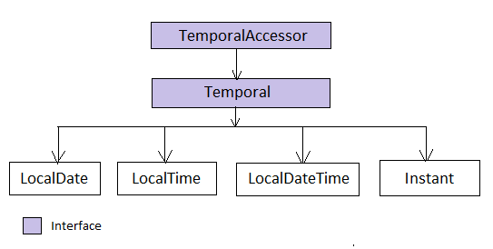

.. raw:: html

    <embed>
		<link rel="stylesheet" href="_static/mystyle.css">
    </embed>

Evolution of date time API
==========================
Working with dates in Java was challenging tasks from the day one. Java 1.0 started with ``java.util.Date`` class to support date functionality but it had several problems and limitations. Despite its name, this class doesn't represent a date but a specific instant in time with millisecond precision. Its hazy design decision of using offsets: the year starts from 1900 and months are zero index based were misleading to the users. As an example if you want to represent March 18, 2014, we have to create instance of Date as follows.

Date date = new Date(114, 2, 18);

Here in the year field we have to pass year as 114 (2014-1900) and 2 as 3rd month which are quite confusing. Date had some of getXXX, setXXX methods to interpret dates as year, month, day, hour, minute, and second values and a ``Date(String)`` for parsing of date strings. Unfortunately, the API for these functions were not easy for internationalization. Another problem could be the arguments given to the Date API methods don't fall within any specific ranges; for example, a date may be specified as January 32 and is interpreted as meaning February 1. There is no explicit control over it.

To overcome all these limitations many of Date class methods were deprecated and ``java.util.Calendar`` class was introduced in Java 1.1, but it still couldn't meet the expectations. It solved some of Date class issues; internally handling offset values: passing 2014 as year rather than passing 114, daling with localization etc, but it has introduced some other problems. Calendar has similar problems and design flaws given below that lead to the error prone code.

* Constants were added in Calendar class but still month is zero index based.
* Calendar class is mutable so thread safety is always a question for it.
* It is very complicated to do date calculations. In fact, there is no simple, efficient way to calculate the days between two dates.
* ``java.text.DateFormat`` were introduced for the purpose of parsing of date strings but it isn't thread-safe. Following example shows the serious problem can occure when DateFormat is used in multi thraded scenarios.

  .. code:: java

    SimpleDateFormat sdf = new SimpleDateFormat("ddMMyyyy");
    ExecutorService es = Executors.newFixedThreadPool(5);
    for (int i = 0; i < 10; i++) {
        es.submit(() -> {
            try {
               System.out.println(sdf.parse("15081947"));
            } catch (ParseException e) {
               e.printStackTrace();
            }
        });
    }
    es.shutdown();
	
	
    Output:
    -------
    Fri Aug 15 00:00:00 IST 1947
    Mon Aug 11 00:00:00 IST 1947
    Fri Aug 15 00:00:00 IST 1947
    Fri Aug 15 00:00:00 IST 1947

If you run the above code multiple times then you will see unexpected behaviors. The existing Java date and time classes are poor, mutable, and have unpredictable performance. Some of the third-party libraries, such as `Joda-Time` showed his interest to overcome the issues with both Date and Calendar classes and it become so popular that it won the attention of Java core development team to include similar features to the Java core API.

`JSR 310 <https://jcp.org/en/jsr/detail?id=310>`_ defines the specifications for new Date and Time API to tackle the problem of a complete date and time model, including dates and times (with and without time zones), durations and time periods, intervals, formatting and parsing. Project `ThreeTen <http://www.threeten.org/>`_ was created to integrate JSR 310 into `JDK 8 <http://openjdk.java.net/projects/jdk8/>`_. The goals of new Date Time API are:

* Support standard time concepts including date, time, instant, and time-zone.
* Immutable implementations for thread-safety.
* Provide an effective API suitable for developer usability.
* Provide a limited set of calendar systems and be extensible to others in future.

Java 8 introduced a new package `java.time <https://docs.oracle.com/javase/8/docs/api/java/time/package-summary.html>`_ to provide a high quality date and time support in the native Java API.

java.time package
-----------------
`java.time <https://docs.oracle.com/javase/8/docs/api/java/time/package-summary.html>`_ package contains many classes to represent basic date-time concepts: instants, durations, dates, times, time-zones and periods based on ISO calendar system. All the classes are immutable and thread-safe. Following are nested packages available in java.time package.

.. list-table::
   :widths: 20 80
   :header-rows: 1

   * - Package
     - Description

   * - `java.time.temporal <https://docs.oracle.com/javase/8/docs/api/java/time/temporal/package-summary.html>`_
     - Each date time instance is composed of fields. This package contains lower level access to those fields.

   * - `java.time.format <https://docs.oracle.com/javase/8/docs/api/java/time/format/package-summary.html>`_
     - Provides classes to print and parse dates and times. Instances are generally obtained from DateTimeFormatter, however DateTimeFormatterBuilder can be used if more power is needed.

   * - `java.time.chrono <https://docs.oracle.com/javase/8/docs/api/java/time/chrono/package-summary.html>`_
     - This is intended for use by applications that need to use localized calendars. It contains the calendar neutral API ChronoLocalDate, ChronoLocalDateTime, ChronoZonedDateTime and Era. Actually the main API is build on ISO-8601 calendar system. However, there are other calendar systems: Hijrah Calendar, Japanese Calendar, Minguo Calendar, Thai Buddhist Calendar also exist for which this package provide support.
	 
   * - `java.time.zone <https://docs.oracle.com/javase/8/docs/api/java/time/zone/package-summary.html>`_
     - This package provides support for time-zones, their rules and the resulting gaps and overlaps in the local time-line typically caused by Daylight Saving Time.

	 
Common methods
-----------------
Java 8 includes a large number of classes representing different aspects of dates like LocalDate, LocalTime, LocalDateTime, Instant, Duration and Period. These classes provides wide set of methods that will serve most of date time usecases. You will find many similar method prefixes to maintain the consistency and easy to remember. For example:

.. list-table::
   :widths: 15 45 40
   :header-rows: 1

   * - Method
     - Description
     - Example
	 
   * - of
     - It is a static factory method to create instance using the required individual field values.
     - LocalDate.of(year, month, day)

   * - from
     - Static factory method to create instance from another date-time aspect. It will throw ``DateTimeException`` if unable to create instance.
     - LocalDate.from(LocalDateTime.now())

   * - to
     - converts this object to another type
     - LocalDateTime.toLocalDate()
       Instant.toEpochMilli()

   * - parse
     - Static factory method to create instance from string.
     - LocalDate.parse("2016-07-12")
	 
   * - get
     - gets the value of something.
     - Period.get(ChronoUnit.YEARS)
	 
   * - with
     - the immutable equivalent of a setter.
     - LocalDateTime.now()
          .withYear(2016)
          .withDayOfMonth(20);
	 
   * - plus
     - adds an amount to an object
     - duration.plusHours(5);
	 
   * - minus
     - subtracts an amount from an object
     - localdate.minusDays(2)
	   instant.minusMillis(1000)

LoalDate, Time, Instant
-----------------------
Following diagram represents the class heirerchy for LocalDate, Time, Instant classes. `TemporalAccesssor` is the base interface defines the read-only access to a temporal object, such as a date, time, offset or some combination of these. `Temporal` interface defines the write access that will manipulate objects using plus and minus operations. We will gradually explore different temporal implementations individually.

   
**LocalDate**
 LocalDate is an immutable object that represents a plain date with out time of day. It doesn't carry any information about the offset or time zone. It stores the date in YYYY-MM-DD format, for example '2014-03-18'. As I mentioned in the `Common methods <#common-methods>`_ section, LocalDate instance can be created in many ways.
 
 .. code:: java
   
   LocalDate.of(2015, 03, 18);     -- When individual values know
   LocalDate.parse("2015-03-18");  -- Creating from date string
   
   LocalDate.now();                -- To get the current date.
   LocalDate.now(ZoneId.of("America/Chicago"));
 
 It also provides additional methods to retrieve its field informations such as Day, Month, Year, Era etc as shown in below example.
 
 .. code:: java
   
   1. LocalDate date = LocalDate.now();
   2. date.getMonth();
   3. date.getDayOfYear();
   4. date.get(ChronoField.YEAR);

 If you  see into line #4, it contains a generic ``get`` method that accepts `TemporalField` type and returns the field value. TemporalField is an interface and java 8 has ``ChronoField`` enum class to hold available temporal field types.

   
**LocalTime**
 Similar to LocalDate class, LocalTime represents only time of the day. It also doesn't hold time zone details. It stores the time in HH:mm:ss.nano_seconds format, for example '04:30:15.123456789'. This class also contain similar set of methods including accessing field values such as ``getHour``, ``getMinute``.

 .. code:: java
   
   LocalTime.of(4, 30, 15);     
   LocalTime.parse("04:30:15.12345");
   
   LocalTime.now();
   LocalTime.now(ZoneId.of("America/Chicago"));
   
   date.getMinute();
   date.getNano();
   date.get(ChronoField.HOUR_OF_DAY);
 

**LocalDateTime**
 LocalDateTime is the combination of LocalDate and LocalTime that holds both date and time parts with out time zone details. The format of stored data is 2007-12-03T10:15:30 whete 'T' is the delimiter between date and time values. Most of the LocalDate and LocalTime methods are applicable to LocalDateTime class. It also contains methods to get LocalDate and LocalTime instances.

 .. code:: java
   
   LocalDateTime.now();
   LocalDateTime.getDayOfWeek();
   LocalDateTime.parse("2007-12-03T10:15:30");
   
   date.toLocalDate();
   date.toLocalTime();

**Instant**   
 Instant is a point on a continuous time line or scale. Basically this represents the number of seconds passed since the Epoch time 1970-01-01T00:00:00Z. Internally Instant stores two values, one long value representing epoch-seconds and an int representing nanosecond-of-second, which will always be between 0 and 999,999,999. Any date-time after 1970-01-01T00:00:00Z will return positive value and before will be negative value.
 
 .. code:: java
   
   1. Instant.now();
   2. Instant.now().getEpochSecond();
   
   3. Instant.parse("1969-01-01T00:00:00.00Z").getEpochSecond();  --> -31,536,000
   4. Instant.parse("1971-01-01T00:00:00.00Z").getEpochSecond();  --> 31,536,000

 Here in line #3 we have supplied one year before epoch time so it is returning a negative long value (1*365*24*60*60 = 31,536,000 secs). Similarly in line #4, given date-time is next year of the epoch time so the result is a positive long value.
 

Duration & Period
-----------------
In the previous section you saw, LocalDate, LocalTime used to work with date and time aspects. Beyond dates and times, the API also allows the storage of periods and durations of time. With the Date and Calendar class it is complicated to do date calculation like days between two dates so duration and period provide solutions for these kind of usecases.

Both Duration and Period class implements ``TemporalAmount``. It is the base interface to represent amount of time. This is different from a date or time-of-day in that it is not tied with any point on time-line or scale, it is as simple as amount of time, such as "6 hours", "8 days" or "2 years and 3 months". As like TemporalField, Java API also provides ``TemporalUnit`` interface to measure time in units of years, months, days, hours, minutes and seconds. ``ChronoUnit`` is the enum that implements TemporalUnit interface which will be used by the end users.

**Duration**
 Duration holds quantity or amount of time in terms of seconds and nanoseconds. Along with these two, it provides some ``toXXX`` methods to access other fields: hours, minutes, millis, days. It also provides a highly used utility method ``between`` to calculate duration among two temporal objects.

 .. code-block:: java
   :linenos:
   
   LocalDateTime d1 = LocalDateTime.parse("2014-12-03T10:15:30");
   LocalDateTime d2 = LocalDateTime.parse("2016-03-05T23:15:00");
   Duration duration = Duration.between(d1, d2);
   duration.toHours();
   duration.toDays();
   
   Duration.between(d1.toLocalTime(), d2).toHours();  -> 12
   Duration.between(d1, d2.toLocalTime()).toHours();  -> DateTimeException
   
   Duration.between(d1.toLocalDate(), d2.toLocalDate());  -> DateTimeException

 If you have marked line #8 is throwing DateTimeException. The reason is when two different temporal objects are passed then the duration is calculated based on the first temporal object. Here the socond argument LocalTime tries to be coverted into LocalDateTime and the convertion failed. One another characteristic of between method is to accept temporal object that supports seconds or nanoseconds due to which line #10 will also throw DateTimeException.
   
**Period** 
 Period represents amount of time in terms of years, months and days. It provides some ``getXXX`` methods to access these fields. Along with field accessing methods it also provides similar methods contained in Duration class.

 .. code:: java
   
   LocalDate date1 = LocalDate.parse("2010-01-15");
   LocalDate date2 = LocalDate.parse("2011-03-18");

   Period period = Period.between(date1, date2);
   period.getYears();     -> 1
   period.getMonths();    -> 2
   period.getDays();      -> 3

 Important point to notice here is getMonths and getDays method doesn't return the number of months or days between these two dates, it is just the numeric value difference between two months and two days. If you want total number of days or months between these dates then use ``LocalDate.until(temporal, unit)``.

 Example: date1.until(date2, ChronoUnit.DAYS)

TemporalAdjusters
-----------------
New Date Time API provides numerous methods: plusHour, minusWeek, withYear, withDays to manipulate temporal objects. Sometime we need to perform advanced operations such as finding next working day for a software firm considering its holiday calendar. One solution is to write temporal object modification logic wherever require in your code but this will cause code repeatation. To help with these scenarios Java 8 provides an interface ``TemporalAdjuster`` to externalize temporal adjustment logic. It has only one abstract method ``Temporal adjustInto(Temporal)`` that takes an existing temporal object and returns a manipulated temporal. Java recommends not to alter the original input temporal object for the thread safety.

The framework interface `Temporal` defines an overloaded version of ``with(TemporalAdjuster)``  method that takes `TemporalAdjuster` as input and returns a new temporal object.

.. code:: java

  default Temporal with(TemporalAdjuster adjuster) {
      return adjuster.adjustInto(this);
  }
  
Remember we can directly call ``adjuster.adjustInto(temporal)`` but is recommended by Java core development team to use the first approach for the sake of maintaining code readability. Java 8 also provides a utility class ``TemporalAdjusters`` that defines most of common adjustment implementations. Suppose to find out the next sunday after the java 8 release date.

.. code:: java

  LocalDate date = LocalDate.parse("2014-03-18");
  TemporalAdjuster adjuster = TemporalAdjusters.nextOrSame(DayOfWeek.SUNDAY);
  System.out.println(date.with(adjuster));

Below table shows the API provided temporal adjuster implementations.

.. list-table::
   :widths: 25 75
   :header-rows: 1

   * - Method
     - Description & Example

   * - dayOfWeekInMonth
     - Returns an adjuster representing temporal instance of the given dayOfWeek that is the nth occurance in the month.
       
       LocalDate date = LocalDate.parse("2014-03-18");
	   
       // 4th monday in the month (2014-03-24)
       date.with(dayOfWeekInMonth(4, DayOfWeek.MONDAY));
       
       // 2nd Sunday in the month (2014-03-09)
       date.with(dayOfWeekInMonth(2, DayOfWeek.SUNDAY));
	   
       // 8th Friday in the month (2014-04-25)
       date.with(dayOfWeekInMonth(8, DayOfWeek.FRIDAY));
	   
       We know that it is not possible to have 8th Friday in any of the month, so here next subsequent months will also be considered.

   * - firstDayOfMonth
     - Returns the adjuster that in turn returns temporal object representing first day of the month.
	 
       LocalDate date = LocalDate.parse("2014-12-03");
       date.with(firstDayOfMonth());  => 2014-12-01

   * - firstDayOfNextMonth
     - Returns the adjuster that in turn returns temporal object representing first day of the next month.

       LocalDate date = LocalDate.parse("2014-12-03");
       date.with(firstDayOfNextMonth());  => 2015-01-01

   * - firstDayOfNextYear
     - Adjuster to return temporal object representing first day of the next year.

       LocalDate date = LocalDate.parse("2014-08-03");
       date.with(firstDayOfNextYear())  => 2015-01-01

   * - firstDayOfYear
     - Adjuster to return temporal object representing first day of the given date year.

       LocalDate date = LocalDate.parse("2014-08-03");
       date.with(firstDayOfYear())  => 2014-01-01

   * - firstInMonth
     - Adjuster to return temporal object representing first occurance of given day in the month.

       LocalDate date = LocalDate.parse("2014-08-03");
       date.with(firstInMonth(DayOfWeek.MONDAY))  => 2014-08-04
	   
   * - lastDayOfMonth
     - Returns the adjuster that in turn returns temporal object representing last day of the month.

       LocalDate date = LocalDate.parse("2014-08-03");
       date.with(lastDayOfMonth())  => 2014-08-31
	   
   * - lastDayOfYear
     - Adjuster to return temporal object representing last day of the given date year.

       LocalDate date = LocalDate.parse("2014-08-03");
       date.with(lastDayOfYear())  => 2014-12-31
	   
   * - lastInMonth
     - Adjuster to return temporal object representing last occurance of given day in the month.

       LocalDate date = LocalDate.parse("2014-08-03");
       date.with(lastInMonth(DayOfWeek.MONDAY))  => 2014-08-25

   * - next
     - Adjuster to return next occurance of given day.

       LocalDate date = LocalDate.parse("2014-08-03");
       date.with(next(DayOfWeek.FRIDAY))  => 2014-08-08

   * - nextOrSame
     - Returns the next-or-same day-of-week adjuster, which adjusts the date to the first occurrence of the specified day-of-week after the date being adjusted unless it is already on that day in which case the same object is returned.

       LocalDate date = LocalDate.parse("2014-08-03");
       date.with(lastInMonth(DayOfWeek.SUNDAY))  => 2014-08-03

	   "2014-08-03" is a SUNDAY, so returned the same date.
	   
   * - previous
     - Adjuster to return previous occurance of given day.

       LocalDate date = LocalDate.parse("2014-08-03");
       date.with(previous(DayOfWeek.MONDAY))  => 2014-07-28
	   
   * - previousOrSame
     - Same as previous method but considers current given date also.

       LocalDate date = LocalDate.parse("2014-08-03");
       date.with(previousOrSame(DayOfWeek.SUNDAY))  => 2014-08-25

Apart from above methods, TemporalAdjusters also contains a generic method ``ofDateAdjuster(UnaryOperator<LocalDate> adjuster)`` to hold the custom logic. User can pass a lambda by wrapping their own date manipulation logic. Below example shows a custom TemporalAdjuster implementation for finding next working day.

.. code-block:: java
   :linenos:

    TemporalAdjuster workingday = temporal -> {
      LocalDate date = (LocalDate) temporal;
      DayOfWeek day = date.getDayOfWeek();
      if (DayOfWeek.FRIDAY.equals(day) || DayOfWeek.SATURDAY.equals(day)) {
          return date.with(next(DayOfWeek.MONDAY));
      } else {
          return date.plusDays(1);
      }
    };

    System.out.println(LocalDate.now().with(workingday));

Formatting & parsing
--------------------
	 

	 
Working with time zone
----------------------

Non ISO calendars
------------------