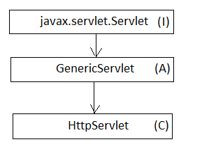
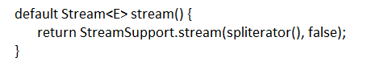

Default and Static methods
==========================
Prior to java8 interfaces were containing only abstract methods but this time you will be able to provide concrete implementations inside interface. Usually interfaces are contracts that defines the set of operations to be supported for a usecase and all of its implementing classes should provide implementations to those abstract methods. When there is a need to provide some basic common functionalities to all implementating classes, the general approach was taken to introduce an abstract class which was inherited by them rather than directly implementing interface. Just to take an example think about Servlet case.

Servlet defines the contract and GenericServlet were introduced just to provide common functionalties to implementing classes like HttpServlet. This was not the bug but an approach taken in older days. Now java has been evolved a lot to remove this intermedite classes and common operations could be reside inside interfaces.

Java8 has introduced many new methods on existing interfaces such as the ``sort`` method in `List` interface, ``stream`` method in `Collection` etc. Java had always argued that its implementing classes must provide concrete implementation to all non-concrete methods of interface. There are millions of libraries and applications running on java and imagine the problem would have happened with directly adding methods inside interface. Java people had tough time to resolve this issue and finally came up with the solutions to add methods using ``default`` keyword.

Default methods
---------------
Default methods enable you to add new functionality to the interfaces of your libraries and ensure binary compatibility with code written for older versions of those interfaces. They provide a default implementation for methods. As a result, existing classes implementing an interface will automatically inherit the default implementations. You specify that a method definition in an interface is a default method with the default keyword at the beginning of the method signature. All method declarations in an interface, including default methods, are implicitly public, so you can omit the public modifier.

To get more clear picture let's discuss the ``stream`` method added in `Collection` interface.

The stream method is required in all List and Set implementations so added in their super interface i.e. ``Collection``. Doing this, stream method will now be directly available to all their implementing classes ArrayList, TreeSet. The default method is not only restricted to java people but you can also add default methods to your own interfaces.

.. code:: java

  interface Vehicle {
  
     default void applyBreak() {
        System.out.println("Applying break.");
     }

     void transport();
  }
  
  class GoodsVehicle implements Vehicle {

     @Override
     public void transport() {
        System.out.println("Transporting goods.");
        applyBreak();
     }
  }

  class PublicTransport implements Vehicle {

     @Override
     public void transport() {
        System.out.println("Transporting people.");
        applyBreak();
     }

  }

  
Multiple inheritance
--------------------
You might have heard of the diamond problem in C++ where a class can inherit two methods of the same signature from two different classes. This is the reason that java adopted multiple inheritance from very begining. But introducing default methods it again opened the gate for the same issue. A class is able to implement multiple interfaces even if they contain abstract method with the same name.

.. code:: java

  public class SampleClass implements A, B {

     @Override
     public void print() {
        System.out.println("SampleClass");
     }

     public static void main(String[] args) {
        A a = new SampleClass();
        a.print();

        B b = new SampleClass();
        b.print();
     }
  }

  interface A {
     void print();
  }

  interface B {
     void print();
  }

This was possible because the method is called on a single interface reference and both the interfaces are not interfering each other, they are just contracts. But now though interfaces can contain concrete methods, there is the possibility of a class inheriting more than one method with the same signature. Java 8 acknowledges this conflict with three basic principles.

1. A method declaration in the class or a superclass wins the priority over any default method declared in the interface.

  .. code:: java
    
    interface A {
        default String print() {
		    return "A";
	    }
    }
	
    class MyClass {
        public String print() {
            return "MyClass";
        }
    }
	
    public class DefaultTest extends MyClass implements A {

        public static void main(String[] args) {
            System.out.println(new DefaultTest().print());
        }
    }
	
    Output: MyClass

  Here `print` method is ingerited by both MyClass and interface A, but MyClass print method has taken into consideration.

  
2. The method with the same signature in the most specific default-providing interface will take the priority. 
  
  .. code:: java
    
    interface A {
        default String print() {
            return "A";
        }
    }
	
    interface B extends A {
        default String print() {
            return "B";
        }
    }
	
    public class DefaultTest implements A, B {

        public static void main(String[] args) {
            System.out.println(new DefaultTest().print());
        }
    }
	
    Output: B

  Here `print` method is inherited by both interfaces but interface A extending B so B will be consider most specific or closer and will be considered.

3. In case choices are still ambiguous, the class inheriting from multiple interfaces has to override the default method and then it can provide its own implementation or can inherit any one. To call the super interface method ``super`` keyward is used.

  .. code:: java
  
    interface A {
        default String print() {
            return "A";
	    }
    }
	
    interface B {
        default String print() {
            return "B";
	    }
    }
	
    public class DefaultTest implements A, B {
	
        public String print() {
            return A.super.print();
	    }

        public static void main(String[] args) {
            System.out.println(new DefaultTest().print());
        }
    }
	
    Output: A

  Here the ``DefaultTest`` class is choosing interface A prividing method with the help of super keyword.

  
Static methods
--------------
In addition to default methods, you can define static methods in interfaces. (A static method is a method that is associated with the class in which it is defined rather than with any object. Every instance of the class shares its static methods.) This makes it easier for you to organize helper methods in your libraries; you can keep static methods specific to an interface in the same interface rather than in a separate class.

Like static methods in classes, you specify that a method definition in an interface is a static method with the static keyword at the beginning of the method signature. All method declarations in an interface, including static methods, are implicitly public, so you can omit the public modifier. Through out the tutorial you have seen lot of example of interface static method like `Stream.of`, ``Comparator.naturalOrder``, ``Comparator.comparing`` etc.