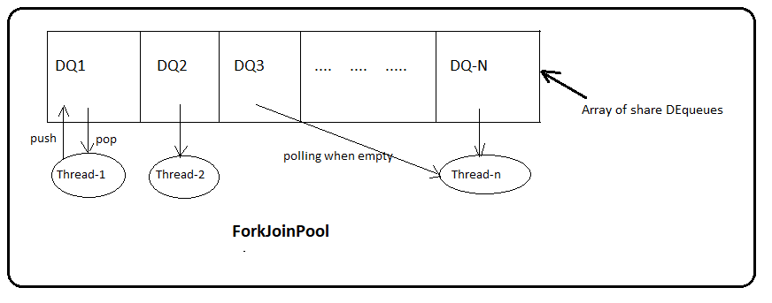
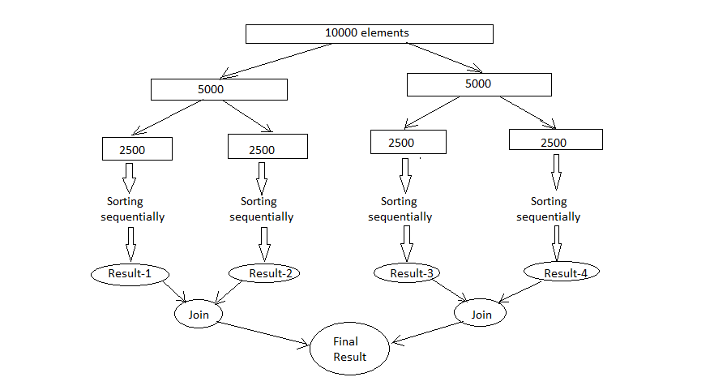

ForkJoinPool
============
In the begining of the tutorial we said- parallelization is almost free, with a small change you can enjoy the benifit of parallel stream processing. The complete parallel stream processing is based on ForkJoinPool concept. ForkJoinPool was delivered with jdk7 which provides a highly specialized ``ExecutorService``. If you can recall, we submit multiple indepenedent tasks to ExecutorService which are then executed by thread-pool threads. In case of parallel stream we don't have multiple tasks where as we have a single complex task of larger size. To execute this big task we have to perform following actions explicitly.

- Divide the big task into smaller sub tasks
- Process all sub tasks independently
- Join the partial results from each sub task

ForkJoinPool internally does all these steps for you. We will typically submit a single task to ForkJoinPool and awaits its completion. The ForkJoinPool and the task itself work togather to divide and conquer the problem. Any problems that can be recursively divided can be a candidature for Fork-Join.

ForkJoinPool creation
---------------------
Creating ForkJoinPool is simple, call its no-arg constructor to create an instance that will internally use ``Runtime.availableProcessors()`` method to determine number of worker threads (ForkJoinWorkerThread) to be used by the pool. It also provides an overloaded `ForkJoinPool(int parallelism)` constructor that allows user to override the number of threads to be created. Usually you shouldn't override the number of threads unless you have a strong reason to do it.

Though it internally uses the number of processors (cores) available to create the worker threads, we should always create a single instance of ForkJoinPool through out the application and different kinds of tasks should be submitted to the same pool. Its implementation restricts the maximum number of running threads to 32767 and attempting to create pools with greater than this size will result to `IllegalArgumentException`. 

.. note:: The level of parallelism can also be controlled globally by setting ``java.util.concurrent.ForkJoinPool.common.parallelism`` system property which will affect every ForkJoinPool creation in your application.

ForkJoinTask
------------
As like Callable and Runnable in ThreadPoolExecutor, fork-join accepts a type of ``ForkJoinTask`` instance for the execution. The abstract base class ForkJoinTask is an implementation of ``java.util.concurrecnt.Future`` that provides common functionalities to its subclasses. It again offers two more abstract subclasses: `RecursiveAction` and `RecursiveTask` which has only one abstract method called "compute()". There is no difference between these two classes except ``RecursiveTask`` can return result where as ``RecursiveAction`` can not. You can assume RecursiveTask is an example of finding largest number from an array where as RecursiveAction is to sort an array which doesn't require to return any result.

ForkJoinTask has large set of methods but the methods we will be using most of the time are: **fork(), compute(), join()**. The compute method will contain the original task to be performed by the worker threads. The following is the pseudo code of the compute method.

::

  if(Task is small) {
      Execute the task
	  
  } else {
      //Split the task into smaller chunks
      ForkJoinTask first = getFirstHalfTask();
      first.fork();
      ForkJoinTask second = getSecondHalfTask();
      second.compute();
      first.join();
  }

The idea behind the fork-join is to divide the task into multiple smaller chunks and execute them independently. The compute method is responsible to split the task if it is not small enough to execute. In the pseudo code we have split the task into two but it can be split into more also. When you call `fork` on the first task it will be pushed into the queue and may be executed by some other thread, then you call compute method on second. After the competion of second task we will call join on the first task to wait for its completion. We will quickly see a complete example which demonstrates finding the largest element in an array.

.. code:: java

  public class ForkJoinPoolTest {

     public static void main(String[] args) {
        int[] array = yourMethodToGetData();

        ForkJoinPool pool = new ForkJoinPool();
        Integer max = pool.invoke(new FindMaxTask(array, 0, array.length));
        System.out.println(max);
     }

     static class FindMaxTask extends RecursiveTask<Integer> {

        private int[] array;
        private int start, end;

        public FindMaxTask(int[] array, int start, int end) {
            this.array = array;
            this.start = start;
            this.end = end;
        }

        @Override
        protected Integer compute() {
            if (end - start <= 3000) {
                int max = -99;
                for (int i = start; i < end; i++) {
                   max = Integer.max(max, array[i]);
                }
                return max;
				
            } else {
                int mid = (end - start) / 2 + start;
                FindMaxTask left = new FindMaxTask(array, start, mid);
                FindMaxTask right = new FindMaxTask(array, mid + 1, end);

                ForkJoinTask.invokeAll(right, left);
                int leftRes = left.getRawResult();
                int rightRes = right.getRawResult();

                return Integer.max(leftRes, rightRes);
            }
        } //end of compute

     }
  }

Here rather than calling `fork, compute` and `join` separately, we used ``invokeAll`` method which internally performs the same. There is no rule to define what is the size of the smaller chunk task, but the task should not be very small that it will loose the benifit of parallelism.

How fork-join works?
--------------------
ForkJoinPool has array of DEqueues (WorkerQueue) which will be shared by all the worker threads. You can assume it is a single shared task queue that is usually used in normal ExecutorServices. Each DEQueue is belongs to one worker thread who will be the owner for that queue. Every time ``fork`` is called on a task will be pushed into its own queue. Each thread repeatedly removes a task from its own DEQueue and runs it. DEQueue support three functions: `push`, `pop` and `poll` where push and pop methods will be called by owner thread only and poll will be called by other threads. If a thread discovers its queue is empty then it becomes a theaf: it chooses a victive thread at random and calls that queue's poll method to steal a task for itself. This process is called `work stealing`.

   
   **Internals of ForkJoinPool**

Initially , only a single thread in a ForkJoinPool will be busy when you submit a task. The thread will begin to subdivide the larger task into smaller tasks. Each time a task is divided into two or more tasks, we fork the every new subtask except the last one we compute. After the computation we invoke join to wait for the forked tasks to complete. This divide-and-conquer process continues untill all the tasks are executed, and all the queues become empty. Mote generally this work stealing algorithm is used to redistribute and balance the tasks among the worker threads in the pool. Below figure shows how this process occurs.

   
   **Splitting of tasks**