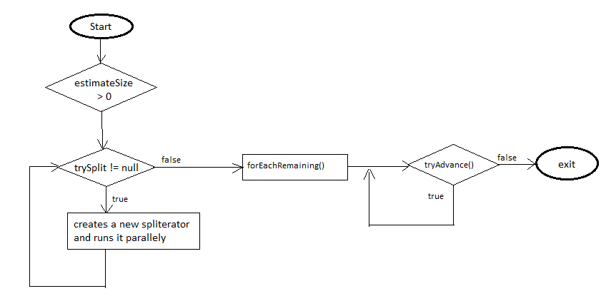

Parallel Data Processing
========================
Compare to earlier days, cost of the hardwares have been reduced and the number of processors (cores) in modern computers are also increased. Each core has ability to perform operations independently. Before Java 7, processing a collection of data in parallel was extreamly cumbersome. First you have to split the complete data set into sub parts and asks the threads to execute them parallelly. In the last chapter we saw how ForkJoinPool perform these operations more consistently and in less error-prone way. To gain better understanding of prallel processing it is important to know how parallel stream works internally. I will strongly recommend you to go through `fork-join-pool <forkjoin.html>`__ chapter if you have missed it.

Parallel Streams
----------------
A `parallel` Stream is a stream that splits its elements into multiple chunks, process each chunk with different thread. Thus you can automatically partition the workload of a given operation on all the cores of your multicore processor and keep all of them equally busy. Getting parallel stream is very easy, just calling ``parallelStream()`` method on collection classes or ``parallel()`` method on sequential stream returns a parallel stream as demonstrated below.

::

  List<String> list = getDataSet();
  list.parallelStream().forEach(System.out::println);
  
  int[] array = {1, 2, 3, 4, 5};
  int sum = Arrays.stream(arr).parallel().sum();

Similarly stream also has ``sequential()`` method that converts parallel stream into sequential stream. In reality stream class maintains an internal boolean state to identify the stream is a parallel stream. Due to this calling `parallel()` and `sequential()` methods multiple times on a stream will not throw any exception. In the below example the last call parallel() will win the priority.

::

  stream.parallel()
     .filter(...)
     .sequential()
     .map(...)
     .parallel()
     .sum();

By now you already have idea that tasks are divided and processed individually in parallel stream. Now let's see how parallel stream internally works. To understand it better we will see following example to find largest element in an array.

.. code:: java
			
    int max = numbers.parallelStream().reduce(0, Integer::max, Integer::max);
    System.out.println("Parallel: " + max);

Here to the reduce method we are passing a BiFunction (2nd argument) which represents the task to be performed when the task become too small and can be executed without splitting again. The last argument is a BinaryOperator shows the action should taken on the two partial results collected from sub tasks. If you want to know about `Stream.reduce` method please refer the `Stream <streamsapi.html#stream-reduction>`__ chapter. Below is the call stack of parallelStream() method.

|
|     parallelStream()
|        StreamSupport.stream(spliterator(), true);
|	        ArrayList.spliterator()
|                ArrayListSpliterator<>();
		

Parallelstream() calls ``spliterator()`` on the collection object which returns a Spliterator implementation that provides the logic of splitting a task. Every source or collection has their own spliterator implementations. Using these spliterators, parallel stream splits the task as long as possible and finally when the task becomes too small it executes it sequentially and merges partial results from all the sub tasks.
	
Spliterator
-----------
Spliterator is the new interface introduced in jdk8 that traverses and partitions elements of a source. The name itself suggests that, these are the iterators that can be splitted as and when require. As like Iterator, Spliterator is also used for traversing elements but meant to be used within stream only. Spliterator has defined some important methods that drives both sequential and parallel stream processing.

.. code:: java

  public interface Spliterator<T> {
  
     boolean tryAdvance(Consumer<T> action);
     default void forEachRemaining(Consumer<T> action);
     Spliterator<T> trySplit();
     long estimateSize();
     int characteristics();
  }

- **tryAdvance** method is used to consume an element of the spliterator. This method returns either true indicating still more elements exist for processing otherwise false to signify all the elements of the spliterator is processed and can be exited.

- **forEachRemaining** is a default method available in Spliterator interface that indicates the spliterator to take certain action when no more splitting require. Basically this performs the given action for each remaining element, sequentially in the current thread, until all elements have been processed.

  .. code:: java
  
    default void forEachRemaining(Consumer<T> action) {
       do {
	   
       } while (tryAdvance(action));
    }
	
  If you see the ``forEachRemaining`` method default implementation, it repeatedly calls the `tryAdvance` method to process the spliterator elements sequentially. While splitting task when a spliterator finds itself to be small enough that can be executed sequentially then it calls `forEachRemaining` method on its elements.

- **trySplit** is used to partition off some of its elements to second spliterator allowing both of them to process parallelly. The idea behind this splitting is to allow balanced parallel computation on a data structure. These spliterators repeatedly calls `trySplit` method unless spliterator returns null indiacating end of splitting process.

- **estimateSize** returns an estimate of the number of elements available in spliterator. Usually this method is called by some forkjoin tasks like `AbstractTask` to check size before calling trySplit.

- **characteristics** method reports a set of characteristics of its structure, source, and elements from among ORDERED, DISTINCT, SORTED, SIZED, NONNULL, IMMUTABLE, CONCURRENT, and SUBSIZED. These helps the Spliterator clients to control, specialize or simplify computation. For example, a Spliterator for a Collection would report SIZED, a Spliterator for a Set would report DISTINCT, and a Spliterator for a SortedSet would also report SORTED.

You saw detailed descriptions on spliterator defined methods, now we will see a complete example that will deliver more context on how does they work.

.. code-block:: java
  :linenos:

  public class SpliteratorTest {

     public static void main(String[] args) {
        Random random = new Random(100);
        int[] array = IntStream.rangeClosed(1, 1_000_000).map(random::nextInt)
                               .map(i -> i * i + i).skip(20).toArray();
        int max = StreamSupport.stream(new FindMaxSpliterator(array, 0, array.length - 1), true)
                               .reduce(0, Integer::max, Integer::max);
        System.out.println(max);
     }

     private static class FindMaxSpliterator implements Spliterator<Integer> {
        int start, end;
        int[] arr;

        public FindMaxSpliterator(int[] arr, int start, int end) {
            this.arr = arr;
            this.start = start;
            this.end = end;
        }

        @Override
        public boolean tryAdvance(Consumer<? super Integer> action) {
            if (start <= end) {
                action.accept(arr[start]);
                start++;
                return true;
            }
            return false;
        }

        @Override
        public Spliterator<Integer> trySplit() {
            if (end - start < 1000) {
                return null;
            }
			
            int mid = (start + end) / 2;
            int oldstart = start;
            start = mid + 1;
            return new FindMaxSpliterator(arr, oldstart, mid);
        }

        @Override
        public long estimateSize() {
            return end - start;
        }

        @Override
        public int characteristics() {
            return ORDERED | SIZED | IMMUTABLE | SUBSIZED;
        }
     }
  }

The FindMaxSpliterator is trying to find out the largest element in an array. Every time `trySplit` method checks the remaining size of the elements in current spliterator and creates a second spliterator if size is more than 100. Once the elements size reaches under 1000, it calls `tryAdvance` method repeatedly on those 1000 (may be less) elements.

   
   **Spliterator Workflow**

Conclusion
----------
Parallel stream make use of both ForkJoinPool and Spliterator to process elements parallelly. It is not the wise decision to use parallel stream all the time without comparing running time between sequential and parallel processing. In the above example we have considered 1_000_000 number of elements which is quite huge and can make sense if executing in parallel, but suppose there were only 5000 elements then parallel stream will give you higher running time compared to sequential because it also includes the time taken for spitting and merging the partial results.