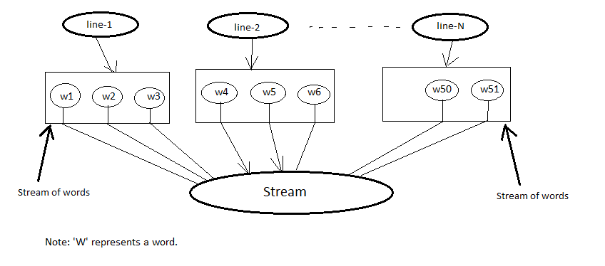

Stream API
==========
In the previous chapter you saw how streams are related to collections, various stream sources and kind of stream operations. In this chapter we will have an extensive look at various operations supported by stream API. `java.util.stream.Stream <http://docs.oracle.com/javase/8/docs/api/java/util/stream/Stream.html>`_ contains numerous methods that let you deal with complex data processing queries such as filtering, slicing, mapping, finding, matching and reducing both in sequential and parallel manner. There are also primitive specialization of streams used for primitive elements and contains additional operations `min, max, sum` etc.

Filtering
---------
Stream interface provides a method ``filter`` which accepts a Predicate as argument and return a stream that matches the given predicate. The predicate will be applied to each element to determine if it should be included to new stream.

:Signature: Stream<T> filter(Predicate<? super T> p)

.. code:: java

    List<String> vowelStart = Stream.of("apple", "mango", "orange")
                                    .filter(s -> s.matches("^[aeiou].*"))
                                    .collect(toList());

    :Output: [apple, orange]

Truncating Stream
-----------------
Stream supports the ``limit(n)`` method accepts a numeric value and returns a new stream consisting of the elements of this stream, truncated to be no longer than maxSize in length. If the stream length is less than the given size then complete stream will be returned.

``limit`` will truncate the stream from end where as there is another method called ``skip(n)`` will discard elements from begining.

:Signature: Stream<T> limit(long maxSize)

            Stream<T> skip(long n)

.. code:: java
	
    Stream<Integer> stream = Stream.of(1, 2, 3, 4, 5);
    stream.filter(i -> i%2 == 0).limit(2).collect(toList());
    stream.filter(i -> i%2 == 0).skip(1).collect(toList());

	
Consuming Stream
----------------
Stream provides two methods ``peek`` and ``forEach`` which accepts a Consumer as argument and applies the consumer to each element.

:Signature: Stream<T> peek(Consumer<? super T> action)

            void forEach(Consumer<? super T> action)

The ``peek`` is an intermediate operation which returns the new stream where as ``forEach`` is the terminal operation returns void.

.. code:: java
	
    Stream<Integer> stream = Stream.of(1, 2, -3, 4, 5);
    stream.filter(i -> i%2 == 0).peek(System.out::println).toArray();
    stream.filter(i -> i%2 == 0).forEach(System.out::println);

Mapping
-------
A very common data processing idiom is to select information from a certain object. For example selecting trade id from an Trade object. Stream supports ``map`` method which accepts a `Function` as argument and returns a new stream consisting of the results of applying the given function to the elements of this stream.

:Signature: <R> Stream<R> map(Function<? super T, ? extends R> mapper)
	
.. code:: java

    List<Trade> trades = new ArrayList<>();
    trades.add(new Trade("T101", "Paul", 5000, "USD", APAC));
    trades.add(new Trade("T102", "Mr Bean", 3580, "SGD", NA));
    trades.add(new Trade("T103", "Simond", 2300, "CAD", EMEA))
	
    trades.stream().map(Trade::getTradeId).collect(Collectors.toList());
	
    Output: [T101, T102, T103]
	
.. image:: _static/map.png
   :align: center
   :width: 600px
   :height: 250px

There are primitive variants of map methods ``mapToInt``, ``mapToDouble`` and ``mapToLong`` that we will see later. Stream interface has method ``flatMap`` which returns a stream consisting of the results of replacing each element of this stream with the contents of a mapped stream produced by applying the provided mapping function to each element. Sometime each element of a stream will produce individual streams that will be amalgamated into single stream and `flatMap` will be used there. It might be confusing you now so let see an example where you need to find distinct words contained in a file. Here we will use ``File.lines()`` which will return Stream<String> where each element will represent to a single line of the file.

.. code:: java

    List<String> words = 
	    Files.lines(Paths.get("flatmap.txt"))     // Stream<String>
            .map(line -> line.split(" "))         // Stream<String[]>
            .map(Arrays::stream)                  // Stream<Stream<String>>
            .distinct()
            .collect(Collectors.toList());
							
    System.out.println(words);

In the above code snippet each line will be splitted to array of words. Each array of words then passed to ``Arrays.stream()`` which will return Stream<String> for every line. ``map(Arrays::stream)`` will return ``Stream<Stream<String>>`` so our final output will be ``List<Stream<String>>`` where as our requirement is ``List<String>``.

Now if you replace ``map(Arrays::stream)`` with ``flatMap(Arrays::stream)`` then all the elements from the each inner stream will be merged to a single outer stream.

.. code:: java

    List<String> words = 
	    Files.lines(Paths.get("flatmap.txt"))    // Stream<String>
            .map(line -> line.split(" "))        // Stream<String[]>
            .flatMap(Arrays::stream)             // Stream<String>
            .distinct()
            .collect(Collectors.toList());
							
    System.out.println(words);

